```mermaid
graph TB
    subgraph "BEFORE: Console Application"
        direction TB
        CA[Console App Entry Point]
        CA --> CAConfig[Configuration Loading]
        CAConfig --> CAAuth[Interactive Browser Auth]
        CAAuth --> CAChat[Chat Loop]
        CAChat --> CARetrieval[SharePoint Retrieval]
        CARetrieval --> CAAI[Azure AI Processing]
        CAAI --> CAOutput[Console Output]
        
        style CA fill:#ffcccc
        style CAConfig fill:#ffcccc
        style CAAuth fill:#ffcccc
        style CAChat fill:#ffcccc
        style CARetrieval fill:#ffcccc
        style CAAI fill:#ffcccc
        style CAOutput fill:#ffcccc
    end

    subgraph "AFTER: Web Application Architecture"
        direction TB
        
        subgraph "🌐 Frontend Layer"
            Browser[User Browser]
            LoadingScreen[Loading Screen UI]
            IndexView[Index.cshtml - Main UI]
            ChatView[Chat.cshtml - Chat Interface]
            Layout[_Layout.cshtml - Bootstrap UI]
            
            Browser --> IndexView
            IndexView --> LoadingScreen
            IndexView --> ChatView
            Layout --> IndexView
            Layout --> ChatView
        end
        
        subgraph "🎮 Controller Layer"
            HomeController[HomeController.cs]
            ConsentController[ConsentController.cs]
            AuthFilter[AuthorizeForScopes Attribute]
            
            IndexView --> HomeController
            ChatView --> HomeController
            HomeController --> AuthFilter
            ConsentController --> AuthFilter
        end
        
        subgraph "🔐 Authentication Layer"
            MSIdentityWeb[Microsoft Identity Web]
            TokenCache[In-Memory Token Cache]
            AuthMiddleware[Authentication Middleware]
            AuthUI[Microsoft Identity UI]
            
            AuthFilter --> MSIdentityWeb
            MSIdentityWeb --> TokenCache
            MSIdentityWeb --> AuthMiddleware
            MSIdentityWeb --> AuthUI
        end
        
        subgraph "⚙️ Service Layer"
            ChatService[ChatService.cs]
            RetrievalService[CopilotRetrievalService.cs]
            FoundryService[FoundryService.cs]
            MailService[GraphMailService.cs]
            
            HomeController --> ChatService
            HomeController --> MailService
            ChatService --> RetrievalService
            ChatService --> FoundryService
        end
        
        subgraph "📊 Data Models"
            ConfigModels[Configuration Models]
            ChatModels[Chat Models]
            ResponseModels[Response Models]
            
            ChatService --> ChatModels
            RetrievalService --> ResponseModels
            FoundryService --> ConfigModels
        end
        
        subgraph "🌍 External Services"
            SharePoint[SharePoint Embedded]
            AzureAI[Azure AI Foundry]
            MSGraph[Microsoft Graph API]
            
            RetrievalService --> SharePoint
            FoundryService --> AzureAI
            MailService --> MSGraph
        end
        
        style Browser fill:#e1f5fe
        style LoadingScreen fill:#fff3e0
        style IndexView fill:#e8f5e8
        style ChatView fill:#e8f5e8
        style Layout fill:#e8f5e8
        style HomeController fill:#f3e5f5
        style ConsentController fill:#f3e5f5
        style AuthFilter fill:#f3e5f5
        style MSIdentityWeb fill:#fff8e1
        style TokenCache fill:#fff8e1
        style AuthMiddleware fill:#fff8e1
        style AuthUI fill:#fff8e1
        style ChatService fill:#e3f2fd
        style RetrievalService fill:#e3f2fd
        style FoundryService fill:#e3f2fd
        style MailService fill:#e3f2fd
        style ConfigModels fill:#fce4ec
        style ChatModels fill:#fce4ec
        style ResponseModels fill:#fce4ec
        style SharePoint fill:#e8f5e8
        style AzureAI fill:#e8f5e8
        style MSGraph fill:#e8f5e8
    end
```

# SPE Agent Web Application Architecture

## 📈 **Web Application Architecture Overview**

This document outlines the architecture of the SPE Agent web application, implementing a chat agent using Azure AI Foundry SDK that retrieves and grounds responses on SharePoint content through Microsoft 365 Copilot Retrieval API.

---

## 🏗️ **Architecture Diagram**


---

## 🔄 **Key Application Features**

### **1. Web Interface**
- **Modern UI**: Bootstrap-based responsive web interface
- **Interactive Elements**: Forms, buttons, progress indicators
- **Loading Screens**: Animated progress with step-by-step indicators
- **Professional Styling**: Enterprise-ready appearance

### **2. Authentication Integration**
- **Microsoft Identity Web**: Seamless OAuth/OpenID Connect integration
- **Delegated Permissions**: Uses user's credentials for SharePoint access
- **Token Management**: Automatic token acquisition and refresh
- **Consent Flows**: Incremental consent for required permissions

### **3. Service Architecture**
- **Dependency Injection**: Proper service registration and lifetime management
- **Interface Abstractions**: Clean separation of concerns
- **Async Processing**: Non-blocking request handling
- **Error Management**: Comprehensive error handling and logging

### **4. Content Processing**
- **SharePoint Integration**: Retrieval of documents and content
- **AI Analysis**: Azure AI Foundry for compliance checking
- **Email Notifications**: Automated reporting to stakeholders
- **Real-time Feedback**: Progress updates during processing

---

## 📁 **Application Components**

### **🎨 Frontend Components**
```
Views/
├── Home/
│   ├── Index.cshtml           # Main landing page with compliance check
│   └── Chat.cshtml            # Interactive chat interface
├── Shared/
│   ├── _Layout.cshtml         # Bootstrap layout template
│   ├── _LoginPartial.cshtml   # Authentication UI component
│   └── Error.cshtml           # Error handling page
├── _ViewImports.cshtml        # Global view imports
└── _ViewStart.cshtml          # View configuration
```

### **🎮 Controllers**
```
Controllers/
├── HomeController.cs          # Main application controller
│   ├── Index()               # Landing page
│   ├── Chat()                # Chat interface
│   └── RunComplianceCheck()  # Compliance processing
└── ConsentController.cs       # OAuth consent handling
```

### **⚙️ Services**

```
Services/
├── IChatService.cs           # Chat orchestration interface
├── ChatService.cs            # Chat orchestration implementation
├── IRetrievalService.cs      # SharePoint retrieval interface
├── CopilotRetrievalService.cs # SharePoint retrieval implementation
├── IFoundryService.cs        # AI processing interface
├── FoundryService.cs         # AI processing implementation
├── IMailService.cs           # Email service interface
└── MailService.cs            # Email service implementation
```

### **🔐 Authentication Features**
- Microsoft Identity Web integration
- AuthorizeForScopes attribute for fine-grained permissions
- Automatic token acquisition and refresh
- Consent flow handling
- Session management

### **🎭 UI Enhancements**
- **Loading Screen**: Animated progress with 4-step indicators
- **Responsive Design**: Bootstrap 5 integration
- **Interactive Elements**: Forms, buttons, progress bars
- **Professional Styling**: Modern web application appearance

---

## 🌊 **Data Flow Architecture**


---

## 🚀 **Application Benefits**

### **👥 User Experience**
- **Accessibility**: Web-based interface accessible from any browser
- **Visual Feedback**: Loading animations and progress indicators
- **Professional UI**: Modern, responsive design
- **Error Handling**: User-friendly error messages and recovery

### **🏢 Enterprise Readiness**
- **Scalability**: Web application can handle multiple users
- **Security**: Proper authentication and authorization flows
- **Monitoring**: Structured logging and error tracking
- **Deployment**: Ready for cloud deployment with Azure

### **👨‍💻 Developer Experience**
- **Maintainability**: Clean separation of concerns
- **Testability**: Interface-based architecture
- **Extensibility**: Easy to add new features and endpoints
- **Debugging**: Rich logging and error handling
- **Consistency**: Same runtime environment across dev/test/prod

### **🔧 Technical Improvements**
- **Configuration**: Flexible appsettings.json configuration
- **Dependency Injection**: Proper service registration and lifetime management
- **Async Processing**: Non-blocking request processing
- **Session Management**: Stateful user sessions
- **Container Orchestration**: Ready for Kubernetes/Docker Swarm

---

## 📈 **Performance & Scalability**

### **Current State**
- **Concurrent Users**: Supports multiple simultaneous users
- **Token Caching**: In-memory caching for development
- **Response Time**: Async processing prevents UI blocking
- **Resource Usage**: Efficient service scoping and disposal
- **Container Overhead**: Minimal due to optimized runtime image

### **Production Considerations**
- **Token Caching**: Upgrade to Redis for distributed scenarios
- **Load Balancing**: Stateless design supports horizontal scaling
- **Monitoring**: Application Insights integration ready
- **Security**: HTTPS, proper authentication flows

---

## 🔧 **Local Development Setup**

### **Requirements**
- .NET 8.0 SDK
- Azure AI Foundry resource
- Microsoft 365 tenant with SharePoint
- Azure App Registration with delegated permissions

### **Quick Start**
```bash
# Clone and setup
git clone <repo>
cd AgentWithSPKnowledgeViaRetrieval
cp appsettings.example.json appsettings.json
# Edit appsettings.json with your values

# Local development
dotnet restore
dotnet build
dotnet run

# Access at http://localhost:5000 or https://localhost:5001
```

This architecture represents a production-ready web application that provides a modern, accessible interface for SharePoint content analysis using Azure AI Foundry, with proper authentication and enterprise-grade scalability.
````

## 🏗️ **Architecture Diagram**



---

## 🔄 **Key Transformations Made**

### **1. Application Type Change**
- **FROM**: Console Application with `Main()` method
- **TO**: ASP.NET Core Web Application with MVC pattern

### **2. User Interface Evolution**
- **FROM**: Command-line interface with text prompts
- **TO**: Bootstrap-based responsive web UI with:
  - Professional landing page
  - Interactive chat interface
  - Animated loading screens
  - Step-by-step progress indicators

### **3. Authentication Enhancement**
- **FROM**: Interactive browser authentication for console
- **TO**: Seamless web authentication with:
  - Microsoft Identity Web integration
  - AuthorizeForScopes for incremental consent
  - Automatic token management
  - Session persistence

### **4. Request Processing**
- **FROM**: Synchronous console loop
- **TO**: Asynchronous web requests with:
  - HTTP POST/GET handling
  - Form submissions
  - Real-time feedback
  - Error handling with user-friendly messages

### **5. Service Architecture**
- **FROM**: Direct service calls in main method
- **TO**: Dependency injection with:
  - Scoped service lifetimes
  - Interface-based abstractions
  - Configuration pattern
  - Logging integration

---

## 📁 **New Components Added**

### **🎨 Frontend Components**
```
Views/
├── Home/
│   ├── Index.cshtml           # Main landing page with compliance check
│   └── Chat.cshtml            # Interactive chat interface
├── Shared/
│   ├── _Layout.cshtml         # Bootstrap layout template
│   ├── _LoginPartial.cshtml   # Authentication UI component
│   └── Error.cshtml           # Error handling page
├── _ViewImports.cshtml        # Global view imports
└── _ViewStart.cshtml          # View configuration
```

### **🎮 Controllers**
```
Controllers/
├── HomeController.cs          # Main application controller
│   ├── Index()               # Landing page
│   ├── Chat()                # Chat interface
│   └── RunComplianceCheck()  # Compliance processing
└── ConsentController.cs       # OAuth consent handling
```

### **🔐 Authentication Features**
- Microsoft Identity Web integration
- AuthorizeForScopes attribute for fine-grained permissions
- Automatic token acquisition and refresh
- Consent flow handling
- Session management

### **🎭 UI Enhancements**
- **Loading Screen**: Animated progress with 4-step indicators
- **Responsive Design**: Bootstrap 5 integration
- **Interactive Elements**: Forms, buttons, progress bars
- **Professional Styling**: Modern web application appearance

---

## 🌊 **Data Flow Architecture**


---

## 🚀 **Benefits of the Transformation**

### **👥 User Experience**
- **Accessibility**: Web-based interface accessible from any browser
- **Visual Feedback**: Loading animations and progress indicators
- **Professional UI**: Modern, responsive design
- **Error Handling**: User-friendly error messages and recovery

### **🏢 Enterprise Readiness**
- **Scalability**: Web application can handle multiple users
- **Security**: Proper authentication and authorization flows
- **Monitoring**: Structured logging and error tracking
- **Deployment**: Ready for cloud deployment with Azure

### **👨‍💻 Developer Experience**
- **Maintainability**: Clean separation of concerns
- **Testability**: Interface-based architecture
- **Extensibility**: Easy to add new features and endpoints
- **Debugging**: Rich logging and error handling

### **🔧 Technical Improvements**
- **Configuration**: Flexible appsettings.json configuration
- **Dependency Injection**: Proper service registration and lifetime management
- **Async Processing**: Non-blocking request processing
- **Session Management**: Stateful user sessions

---

## 📈 **Performance & Scalability**

### **Current State**
- **Concurrent Users**: Supports multiple simultaneous users
- **Token Caching**: In-memory caching for development
- **Response Time**: Async processing prevents UI blocking
- **Resource Usage**: Efficient service scoping and disposal

### **Production Considerations**
- **Token Caching**: Upgrade to Redis for distributed scenarios
- **Load Balancing**: Stateless design supports horizontal scaling
- **Monitoring**: Application Insights integration ready
- **Security**: HTTPS, proper authentication flows

---

This architecture transformation converted a simple console application into a production-ready web application while maintaining all the core functionality and significantly enhancing the user experience and enterprise readiness.